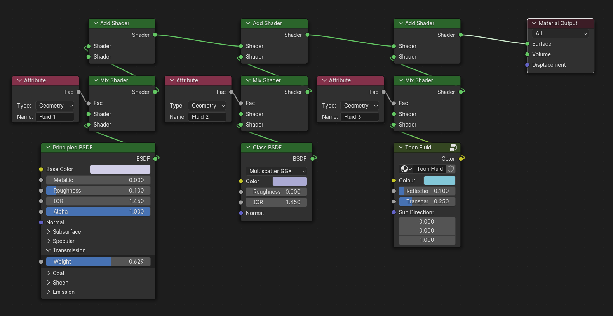

Fluid-Particles
===
A simple tool to create small quick fluid sims in blender. 
---

Creating detailed fluid simulations is well known to be a long and arduous process, and even more so in blender, but will give you beautiful results when working on larger scales with lots of fluid. But what if you don't need all that? What if you just need a quick small scale fluid sim? Thankfully, that's what this addon is intended for.

This addon utilizes Blender's particle system's Fluid physics type and is simply designed to be a quick and easy to setup, adjust, and control multiple sims at once in, what would otherwise be, a confusing and convoluted method of simulating fluid. Designed primarily to be able to add multiple sims that all interact with each other, and automatically set up a fluid surface mesh to render out the fluid and support blending between multiple fluid types.

How To Use
===
The addon is split up into 3 different tabs: Simulation Settings, Animation Settings, and Render Settings.
(Simply listed as "Simulate", "Animate", and "Render" since space is limited.)

Simulation Settings
---
All of these sections are pretty self-explanatory, but this tab is where you'll be controlling the simulation parameters, anything and everything that defines how the fluid will react to the world.

- Streams: Where you'll add/remove particle systems (or "Streams" as I like to call them) from an emitter, as well as control:
  - Particle count: How many particles this stream will emit. This is probably the biggest downside to this method; you have to define exactly how many particles to use as it won't automatically adjust for you.
  - Start Frame: When the selected stream will start emitting particles.
  - Duration: How long the selected stream will emit particles for.
  - Velocity: How strong the particles will emit from the surface (based on the surface normal, so I recommend using a simple plane as an emitter unless you have a specific reason not to).
  - Linking (Chain icons on the list itself): This is how you control what streams will interact with other streams. This is set to off by default (as linking can lead to a huge performance hit depending on how many streams you have), but can be set to only interact with other streams in this emitter (given they also have any kind of linking enabled), or interact with all streams from all emitters (given they are also set to interact with other emitters).
  - Visibility (Screen and camera icons on the list itself): Enable/disable the stream in either the viewport or when rendering. Disabling a stream in the viewport will also keep blender from calculating the stream, which is ideal when you need to work on other parts of your stream and the streams are slowing blender down.
  
  Unlike the other items in this tab, these parameters are all exclusive to each individual stream, so don't be startled if they change when you select a different stream.

- Baking: Not actually simulation parameters, but it's here none the less. Since blender doesn't allow me to only bake all specified simulations at once, I've opted to offer multiple options for whichever suits your needs the most.
 - Bake/Unbake Stream: Only bake or delete the bake of the currently selected stream. (Can sometimes cause issues if trying to bake multiple streams this way, so ideal for when you're only working with a single stream.)
 - Cache to Bake/Unbake Emitter: Will save the playback cache for all streams in each selected emitter or delete all bakes in the selected emitter (if currently selected stream is already baked.)
 - Bake/Unbake All Physics: Will bake all physics of any type in the scene. This includes particle systems, cloth simulations, soft bodies, rigid bodies, etc. (Ideal if you're either only working with fluid sims or want to bake other sim types simultaneously for accurate interactions.)

- Recalculate: Think of this as a panic button, if something goes wrong with the simulation, this'll force all streams on an emitter to reset, clear they're bakes and playback caches, rebuild links to other streams, and set the frame to the start of the simulation.
- Copy Settings: This'll copy all settings below from the active emitter to other selected emitters, with the exception of:

- Particle Catcher: This'll add an invisible plane that'll kill any particles that collide with it, meant to delete particles that go off screen or form hurting performance as they endlessly falling into oblivion. (Note that it won't delete particles that are below it, only ones that try to pass said height, so particles that spawn below it won't be deleted.)

- Lifetime: How long the particles will live for. Set to your scene's end frame if you never want them to die. Alternatively, you can add some randomness to when they die to help them fizzle out rather than die at an exact time after being spawned (useful for creating looping animations.)

- Size: How big the particles are. This'll also affect how close they can get to collision objects.

- SubFrames: How frequently blender should calculate the simulation between each frame. Since fluid sims are much more complicated than normal particle simulations, it's important to give blender some leeway to calculate things. Alternatively, you can tell blender to automatically add subframes where need be by setting a threshold (though it'll usually be a bit slower to simulate than if you just set the subframe count manually).

- Mass: How heavy the particles are. This only affects how different streams interact with each other. i.e., a lighter fluid will displace a heavier fluid.
- Viscosity: How **thicc** the fluid is. (It has something to do with internal friction, but just think of it as a consistency slider that goes from water to honey).
- Radius: This defines how many times larger than the size each particle is and, unlike the size parameter, only affects how particles interact with each other and not how they react to collision objects. (If the difference between this and Size is lost on you, then just leave this at 2 and only adjust the size parameter.
- Stiffness: How incompressible the fluid is.
- Repulsion: How much particles push away from each other (based on Stiffness).
- Density: How much particles are allowed to intersect with each other. (Useful when used in tandem with Radius.)

- Gravity: How much particles are affected by gravity.
- Force Fields: How much particles are affected by other forces (excluding collision objects).

Animation Settings
---
If you've noticed that the particles don't emit at a consistent speed, don't worry, that's a feature not a bug. This is the tab where you'll control changes in the particle's velocity over time, as having them emit at a constant stream is often fairly lackluster and we end up animating it anyway. Unlike the last tab, all these settings are relative to the selected stream.

- Streams and Baking: Exactly the same as in the last tab. I only added this here to be able to easily switch between streams and adjust the velocity for each stream, and cause Baking felt relative and important to add here as well.

- Strength Parameters: How fast the particles will emit at the Start, Peak, and End of the particle's emission, relative to the stream's velocity.
- Peak Time: How far into the particle's emission will they reach their fastest speed.

Render Settings
---
This tab is where you'll control the fluid surface. Keep in mind that these settings are universal and aren't based on the streams at all, outside of the box of material parameters at the bottom that are unique to each emitter. Because of this, you can access these settings regardless of what object is selected, or even if no object is selected at all.

- Fix Surface: Reimport the fluid surface, its default material, and the hidden instance objects that might've gotten broken when deleting an emitter.

- Size Multiplier: How many times larger than the particle's radius should they render as. (Useful for offsetting the smoothing effect the fluid surface provides.)
- Quality: The density of vertices the fluid surface will have (relative to the smallest radius of all emitters).
- Viewport Display: Defines the quality of the fluid in the viewport (relative to the quality setting above). Setting this to 0 will hide the fluid surface altogether in the viewport and keep from calculating it at all (as it can be quite slow at times), but will continue to show the particles for each fluid as a lightweight visualization. I recommend leaving this off anytime you don't actively need to see the fluid surface itself.

- Smoothing: How much the surface will be smoothed over, to make it look more fluid like at the cost of minor artifacts when particles are barely touching in weird ways.

- Material Blending: Blends the material parameters for each emitter together wherever the streams interact.

- Custom Material: Where you can create your own material to use instead of the default one, though blender has no way of blending between materials so you can only set one. You can create a compound material that'll manage different materials. More info on how to do that is below. (Note that the active fluid material is also set on each emitter object for ease of access, so feel free to alter it however you like.)

Material Parameters (relative to each emitter):
- Material ID (Only available with a Custom Material set): This'll let you switch between sections of a compound material. More info below.

- Colour: The colour of this emitter's fluid.
- Roughness: How shiny/matte the fluid is.
- Density: How thick or cloudy the fluid is. (Node that the cycles default material uses volumetrics for density, which can't be controlled dynamically via geometry nodes, so it'll default to the highest density of all emitters.)
- Emission Colour: The colour the fluid will glow. (Set to black to disable.)
- Emission Strength: How strong the fluid will glow.

- Copy Settings: Will copy the active emitter's material parameters to all other selected emitters.

Collision Objects
---
When you first selected an object to add a stream, you were probably greeted with the option to either set it as Emitter or set it as Collision. That's because navigating down to the physics tab for collision objects felt tedious and disjointed when everything else is in one single panel. Thanks to my laziness, you can also easily control collision objects from within the addon as well.

(Also, node that collision objects will also interact with cloth and soft body simulations. Sorry, I wish it didn't but that's out of my hands.)

- Set as/Disable Collision: This'll tell blender to use this object for collisions rather than as an emitter. If there isn't already a collision modifier, then it'll add a collision modifier to the bottom of your modifier stack, so be sure to move it to the right place if need be (as super high poly collision objects will slow things down significantly for little benefit). Disabling collision will also delete the collision modifier from the object.

- Cage: If your object is fairly high poly and you have a lower poly version you want to use for collisions instead, you can set the low poly version as a collision cage. This'll remove the collision modifier from your main object and add one to the cage instead. (Note that the following settings will be visible on both the original object and the cage object:)

- Damping: How much the collision object will prevent particles from bouncing off it. (Recommend Value: 0.75)
- Friction: How much the collision object will prevent particles from sliding across it. (Recommend Value: 0.25)
- Permeability: How likely each particle is to pass through the collision object (calculated each frame).
- Stickiness: How much particles will stick to the collision object (i.e. overhangs).

Setting Up a Compound Material
===
As blender doesn't let you directly blend between multiple materials, there isn't a way for me to easily let you assign materials to different emitters. However, I did add attributes to help you create your own Compound Materials (a material with multiple different materials inside of it). It's a bit of a process to set up, but hopefully I can help simplify it a small bit and make it a viable option for people to do. (Do keep in mind that if you only need a single material for all your fluids, then this process isn't at all necessary.)

1) Under any emitter or the fluid surface itself, go to the material properties tab and unlink the "Default Fluid Mat" material (the little X icon next to the name) then add a new material in its place. Alternatively, you can duplicate the default material and adjust it to work with this method, though I'll be starting from a blank slate for this.

2) In the fluid particles panel, under Render Settings, set your newly made material as the Custom Material. We do this early just to make sure that the addon won't set it back to the default material when you adjust anything in the addon.

3) Now we'll open the shader editor and finally start making the compound material. The setup is fairly straightforward, consisting of 4 main parts:
  - An Attribute Node: This is what we'll use to define if an emitter will use this material or another. We'll set this to "Fluid 1", where the 1 is for emitters with a Material ID of 1. This'll be connected to the factor of a
  - Mix Shader Node: This is for limiting our material to only apply to streams set to the right Material ID, which in this case is an ID of "1". The first shader input will be left empty, while the second is where we'll connect our
  - Fluid Material: This can be whatever you want to use for your fluid, a Principled BSDF shader, a Glass shader, or even just an RGB value. The only things it can't be are volume nodes, as blender doesn't yet allow you to control volumes through geometry nodes assigned attributes (outside of instancer attributes, which the "Fluid #" ones are not). If your material is really big/has a lot of nodes, it might help to put it inside a group to keep things a bit cleaner.
  - Lastly, an Add Shader Node: This is to let the other materials show on vertices they are assigned to without having to sweep though Material IDs like using a Mix Shader would require. Connect the output of the mix shader node to this, either input is fine (though you can technically skip this node for the first material).

4) Copy this over for as many materials you want to use, changing the Attribute node to the proper material ID each time. At the end if it all, your material should look something like this:   

5) In you emitters, under the render settings tab, a new parameter called "Material ID" should've appeared. You can change that to use whichever material inside your compound material that you want. And with that, you're all set. Blender will now automatically blend between these materials when streams collide.

Though if you still want to use the provided material parameters in the addon, then you simply need to add the corresponding attribute for them:
Attribute | Type
--- | ---
Colour | Color value
Roughness | Float value
Density | Float value
Emission Colour | Color value
Emission Strength | Float value
Volume Density | (Instancer) Float value
